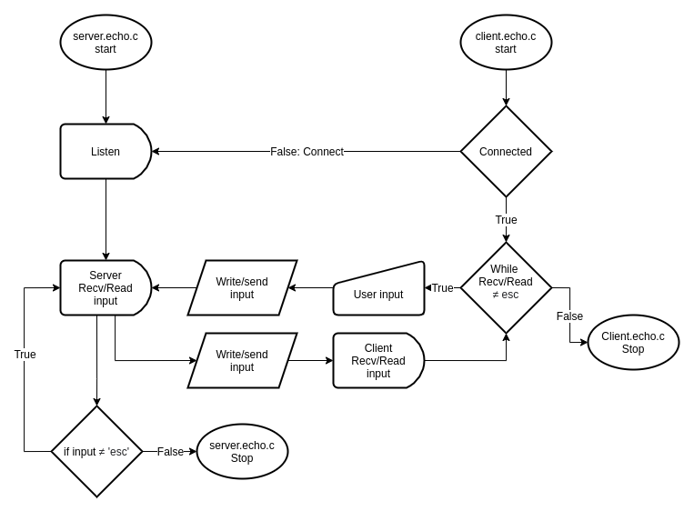

# **Relazione tecnica - Socket Server**

> ## **Indice**
>1) [**Definizione del problema**](#1-definizione-del-problema)
>2) [**Architettura**](#2-architettura)
>3) [**Criticità da discutere**](#3-criticità-da-discutere)
>4) [**Codice**](#4-codice)
>5) [**Testing**](#5-testing)
>6) [**Conclusioni**](#6-conclusioni)

## *1) Definizione del problema*
Lo scopo di questa esercitazione è quello di creare un server echo utilizzando i socket, quindi bisogna poter connettersi al server tramite il telnet, e inviadre dati per riceverli di nuovo come ricevuta conferma.

## *2) Architettura*


## *3) Criticità da discutere*
La criticità principale è che il server non è in grado di gestire più di un client alla volta, quindi se un client si connette, il server non può accettare altri client.

## *4) [Codice](../Src/server.echo.c)*
In questo esercizio ho utilizzato la libreria `sys/socket.h` per la gestione dei socket, e la libreria `netinet/in.h` per la famiglia dei socket.

Define utilizzati nel codice:
```c
    #define SOCKET_ERROR    ((int)-1)
    #define SOCKET_PORT ((int)5000)
    #define RETURN  ((int)13)
    #define QUIT    ((int)27)
```
___
Per prima cosa si definiscono i parametri per la creazione del socket di handshake
```c
    server.sin_family = AF_INET;
    server.sin_addr.s_addr = htonl(INADDR_ANY);
    server.sin_port = htons(SOCKET_PORT);
```
Dove `AF_INET` è la famiglia di socket, `INADDR_ANY` è l'indirizzo del server, `SOCKET_PORT` è la porta del server.
______

Successivamente creo il socket di handshake:
```c
    if ((handshakingSocket = socket(AF_INET, SOCK_STREAM, 0)) == SOCKET_ERROR){
        perror("handshakingSocket");
        return 1;
    }
```
______

E lo `lego` alle specifiche del server:

```c
    if (bind(handshakingSocket, (struct sockaddr *)&server, sizeof(server)) == SOCKET_ERROR){
        perror("bind");
        return 1;
    }
```
______

Dopo aver creato il socket di handshake, lo metto in ascolto, così da permettere la connessione del client:
```c
    if (listen(handshakingSocket, 1) == SOCKET_ERROR){
        perror("listen");
        return 1;
    }
```
Dove `1` è il numero massimo di client che possono connettersi al server.
Anche se per come è gestito il server, quindi che si auto chiude dopo aver ricevuto `esc` non può gestire più di una connessione per sessione.
<br/><br/>
______
Completate queste operazioni il server è pronto per accettare la connessione del client.

```c
    if ((commSocket = accept(handshakingSocket, (struct sockaddr *)&client, &clientLength)) == SOCKET_ERROR){
        perror("accept");
        return 1;
    }
```
___
Se la connessione è stata eseguita con successo il client riceverà un messaggio da parte del server
```c
    send( commSocket , "Hello! Echo server here.\nTo end connection type and enter esc\n", 63, 0);
```
___
Adesso è tutto pronto, e il server tramite la seguente funzione riceve i dati dal client e li invia di nuovo al client come echo:
```c
    do {
        if (recv(commSocket, &readASCII, 1, 0) != SOCKET_ERROR) {
            asciiVal = (int)readASCII;
            if (asciiVal != RETURN && asciiVal != QUIT){
                if(isprint(asciiVal)){
                    printf("RECV:[%c][%d] Echoing..\n", readASCII, asciiVal);
                }
                else printf("RECV:[%d][%d] Echoing..\n", readASCII, asciiVal);
                send( commSocket , &readASCII, 1, 0);
            }
        }
        else{
            perror("recv");
            return 1;
        }
    } while (readASCII != QUIT);
```
Il server riceve un carattere alla volta, e lo invia di nuovo al client, se il carattere ricevuto è `esc` il server si chiude.

Oltre a questo esegue anche un controllo per assicurarsi che i caratteri inseriti siano visibili, in caso contrario stampa il valore `ASCII` del carattere ricevuto. 
___

## *4.1) Compilazione e lancio del codice*

Link Makefile: [***Makefile***](../Src/makefile)

Per compilare il codice si utilizza:
```makefile
make build
```
Per eliminare i file eseguibili:
```makefile
make clean
```
Per lanciare il codice si utilizza:
```makefile
make run
```
___
Per connettersi al server si utilizza:
```makefile
make connect
```
___

## *5) Testing*
L'unico problema riscontrato all'inizio durante la fase di testing, era che il tasto esc, il cui scopo era terminare il collegamento dava errori nel print del carattere, ma questo problema è stato risolto con la funzione `isprint()`, che permette di controllare se il carattere è stampabile o meno.
Per il resto non sono stati riscontrati problemi rilevanti.

## *6) Conclusioni*
In questa esercitazione ho imparato a utilizzare i socket per la creazione di un server echo, e a gestire le connessioni tra client e server.
